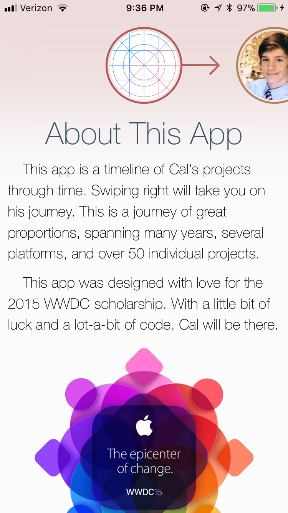
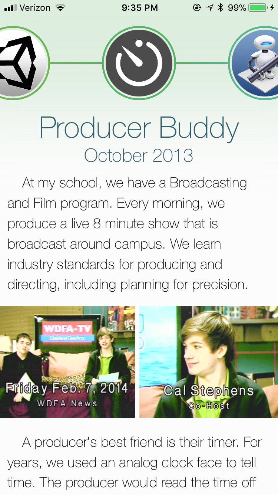
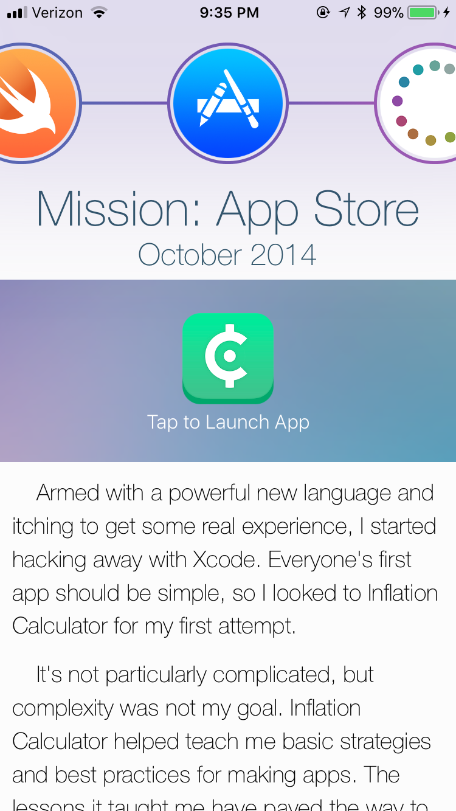
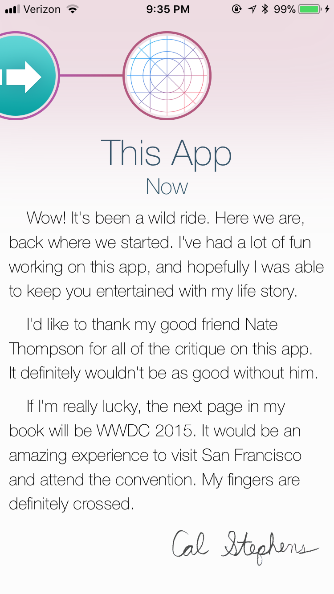
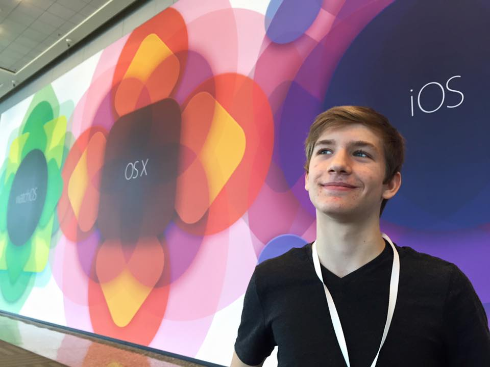
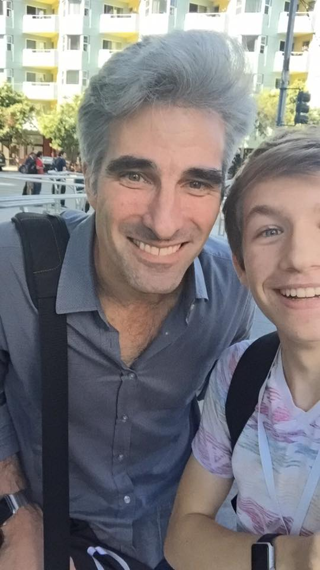

## About-Cal

This app was created for the 2015 WWDC Student Scholarship contest, and accepted as a winner! The contest prompt was to create an iOS app about yourself using Swift.

### Screenshots

       

**[Watch a Video Demo](https://www.youtube.com/watch?v=6HlfvftH24s)**

### WWDC 2015

This app won me a scholarship to attend WWDC 2015 in San Francisco. This was my first time out West, and it was a really cool experience! I attended sessions, camped overnight for the keynote, and met Craig Federighi!

    

     

